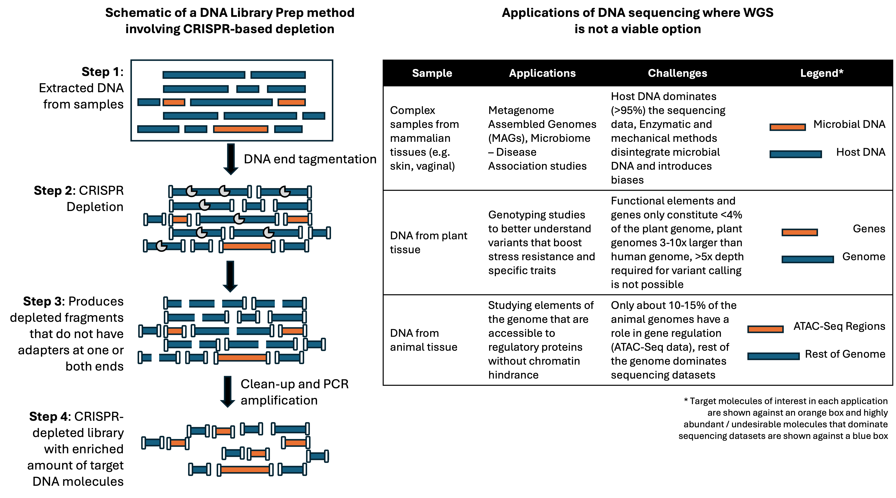

# CRISPR Design for Depletion of Abundant Molecules in DNA Sequencing Applications

Description of bioinformatics pipelines and methods to design CRISPRs for DNA sequencing applications

## The Biological Challenge: 

DNA sequencing is a popular method to interrogate the genome. However, several applications require higher sequencing coverages at targeted sections of the genome. Hence, the use of whole-genome sequencing (WGS) methods poses a few challenges. Here are some examples:

1. For metagenomics studies, the host DNA often dominates sequencing data and dilutes the microbial content for genome assemblies
2. In argi-genomics applications (e.g. plant genotyping), researchers would like to study the variants in the functional parts of plant genomes. Plant genomes are generally larger and less than 5% of their genome is functional. WES is a viable alternative, but may require the design and synthesis of probes (and the expenses that come with it)
3. The study of gene regulation in animal genomes requires researchers to sequence only the regulatory elements identified by ATAC-Seq or other similar methods. Unfortunately, only 10-20% of the genome constitutes elements that are involved in gene regulation. Cell type, environmental stresses and other factors contribute to the variable nature of regulatory elements that makes it harder to design a probe-based capture approach for this application. 

Furthermore, almost all library preparation methods involve PCR enzymes that amplify adapter-ligated nucleic acid molecules. This results in a *jackpotting* effect exponentially increasing the amount of abundant DNA. The need here is a method that can selectively remove undesirable molecules *prior* to sequencing. To this end, CRISPR endonucleases offer a simple solution. The CRISPR-Cas enzyme fused with a small guide-RNA (gRNA) molecule whose sequence is complementary to the target DNA can offer (arguably) a high degree of specificity in cleaving them. Bioinformatics design pipelines can be developed aimed at generating CRISPR-gRNAs that selectively cleave these undesirable DNA molecules. One can, hence, take advantage of clean-up and PCR steps that follow to remove them completely - cDNA molecules cleaved by CRISPRs will not have adapters ligated at their ends and hence, will not be amplified. The result would be a final sequencing library highly enriched with only the target molecules of interest for the application. 

The uniqueness of the computational challenge in developing this method lies in the number of CRISPR-gRNAs needed. Compared to *in vivo* gene editing, this application requires the use of thousands of CRISPR-gRNAs to deplete a vast majority of nucleic acid molecules in sequencing libraries. Hence, the **bioinformatics challenge** is:

*Assemble an integrated bioinformatics CRISPR design and analysis pipeline with all necessary guardrails that provide gRNAs for the in vitro depletion of undesirable DNA in a library preparation process*

## The Bioinformatics Method:

Important Notes: 

1. The DASH (https://genomebiology.biomedcentral.com/articles/10.1186/s13059-016-0904-5) methodology introduced by Gu *et* *al* (2016) uses a similar technique to deplete mitochondrial rRNA in HeLa cells. 

2. Several other studies have been published that uses the power of CRISPRs to deplete abundant RNA and DNA molecules from sequencing libraries. Here are a couple of papers that I have published: CRISPR depletion for [single cell RNA applications](https://pubmed.ncbi.nlm.nih.gov/40389438/) and [infectious disease detection](https://www.cell.com/cell-reports-methods/pdf/S2667-2375(23)00082-6.pdf)

3. Jumpcode Genomics owns the intellectual property for commercial use of this method. Please reach out to [Keith Brown](keith@jumpcodegenomics.com) for commercial queries. 

4. My goal here is to only provide a bioinformatics framework for folks interested in this method. You can use any code available to make your own designs for CRISPR-gRNAs that you would like to use in your work. But Jumpcode Genomics is the sole proprietary owner of the commercial rights to this technology.

5. The design of CRISPR-gRNAs and information provided here is generic. Several downstream steps are required to computationally tune the CRISPR-gRNAs for use in a library preparation method. 

