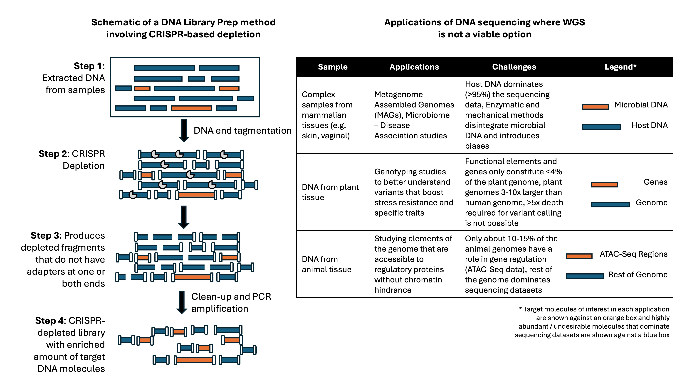

# CRISPR Design for Depletion of Abundant Molecules in DNA Sequencing Applications

Description of bioinformatics pipelines and methods to design CRISPRs for DNA sequencing applications

## The Biological Challenge: 

The versatility offered by DNA sequencing to interrogate the genome is unparalleled. However, the use of whole-genome sequencing (WGS) to study targeted sections of genomes presents some challenges. Firstly, the method produces sequencing datasets with a *uniform* coverage across the genome. This amounts to wastage of sequencing reagents and data when only a fraction of the genome is of interest to your research goals. Secondly, WGS produces lower coverages for larger genomes (compared to the human genome) and those that are polyploids which makes it difficult for genotyping and variant analysis. Therefore, these and several other applications fail to fully exploit the power of WGS. More examples:

1. For metagenomics studies, the host DNA often dominates sequencing data and dilutes the microbial content for genome assemblies. When the microbial content is minimal, detection of key microbes becomes a challenging task using a DNA-based sequencing approach
2. In argi-genomics applications (e.g. plant genotyping), researchers would like to study the variants in the functional parts of plant genomes. They resort to low-pass WGS (LP-WGS) or Genotyping-By-Sequencing studies where the coverage is typically <3x across the genome. Plants are polyploids, with larger (and often, incomplete) genomes and less than 5% of their genome is functional. The presence of repetitive elements (typically 45-70% of the genome) overrepresents sequencing datasets diluting the ability to uncover variants in genes. Whole-Exome Sequencing (WES) is a viable alternative, but may require the design and synthesis of probes (and the expenses that come with it)
3. The study of gene regulation in animal genomes requires researchers to sequence only the regulatory elements identified by ATAC-Seq or other similar methods. Unfortunately, only 10-20% of the genome is involved in gene regulation. Cell type, environmental stresses and other factors contribute to the variable nature of regulatory elements that makes it harder to design a probe-based capture approach for this application. 

*Figure 1: Schematic representation of a DNA library preparation methodology with CRISPR-based depletion and examples of some applications when WGS is not a viable method*

Furthermore, almost all library preparation methods involve PCR enzymes that amplify adapter-ligated nucleic acid molecules. This results in a *jackpotting* effect exponentially increasing the amount of abundant DNA. The need here is a method that can selectively remove undesirable molecules *prior* to sequencing. To this end, CRISPR endonucleases offer a simple solution. The CRISPR-Cas enzyme fused with a small guide-RNA (gRNA) molecule whose sequence is complementary to the target DNA can offer (arguably) a high degree of specificity in cleaving them. Bioinformatics design pipelines can be developed aimed at generating CRISPR-gRNAs that selectively cleave these undesirable DNA molecules. One can, hence, take advantage of clean-up and PCR steps that follow to remove them completely - cDNA molecules cleaved by CRISPRs will not have adapters ligated at their ends and hence, will not be amplified. The result would be a final sequencing library highly enriched with only the target molecules of interest for the application. 

## The Bioinformatics Challenge: 

The uniqueness of the computational challenge in developing this method lies in the number of CRISPR-gRNAs needed. Compared to *in vivo* gene editing, this application requires the use of thousands of CRISPR-gRNAs to deplete a vast majority of nucleic acid molecules in sequencing libraries. 

Additionally, the CRISPR-Cas enzyme is known to exhibit non-specific cutting on dsDNA that shares homology with the 20-nt gRNA target sequence. Any application that uses CRISPRs will have to consider bioinformatics methods to mitigate off-target effects. Hence, the **bioinformatics challenge** is:

*Assemble an integrated bioinformatics CRISPR design and analysis pipeline with all necessary guardrails that provide gRNAs for the in vitro depletion of undesirable DNA in a library preparation process*

## The Method:

### Dependencies:

|#|Software|Source|
|-|--------|------|
|1|<ins>CRISPR design tool</ins>: There are many available as open source. You can even write your own script or repurpose an alignment tool to do this. I have used multiple CRISPR design tools in the last 10 years - [FlashFry](https://github.com/mckennalab/FlashFry), [CRISPOR](https://github.com/maximilianh/crisporWebsite) etc. I recommend CRISFlash for its ease of use and its speed. It is amenable to identify gRNA target sites for any flavor of the CAS enzyme. I have written a few parsers to manipulate output files it provides.|This pipeline uses CRISFlash. It's available from Adrien Jacquin and Margus Lukk's [GitHub](https://github.com/crisflash/crisflash). Download the CRISFlash binary and edit the config.yml with the absolute path to CRISFlash binary. |
|2|<ins>Bedtools Software Suite</ins>: I use BEDTOOLS to merge, sort and complement intervals in the genome that need to be protected. You can use some of the interval list tools offered by Picard interchangeably. |[BedTools Software Suite](https://bedtools.readthedocs.io/en/latest/content/bedtools-suite.html) - Best practice is to install within a conda environment. |
|3|<ins>Java Runtime Environment (JRE) or Java Development Kit (JDK) to run a few helper scripts.|The `workflow_env.yml` file lists the dependencies required for the pipeline. |
|4|Python and Snakemake|Use conda to install the correct versions|

Samtools or PicardTools is always a good tool to have in your arsenal.

### Step 1: Preparing the reference genome(s):

CRISFlash requires the reference the genome in a very specific condition. Soft-masked DNA and IUPAC ambiguous DNA letters cause issues while running CRISFlash. I have also observed issues when fasta headers in the reference genomes are too long. To avoid this:

<pre>
sed -i "s/ .*//g" reference_genome.fa # fixes spaces and removes fasta headers with spaces in them

awk '{
    if ($0 ~ /^>/) {
        print $0; # Prints the fasta header as is
    } else {
        gsub (/[^ACGTacgt]/, "N"); # Replaces IUPAC DNA letters with Ns
    }
}' reference_genome.fa
</pre>

BEDTOOLS used in the pipeline requires a genome file (chromosome/fasta headers and chromosome length). You can prepare this file using samtools faidx. 

<pre>
reference_fasta="/path/to/reference_genome.fa";
samtools faidx $reference_fasta;
awk -v FS="\t" -v OFS="\t" '{print $1,$2;}' "${reference_fasta%.fa}.fa.fai" > "${reference_fasta%.fa}" # Creates the genome file
</pre>

### Step 2: Running the pipeline:

To clone the pipeline:
<pre>
git clone https://github.com/sridhar-rg/crispr-design-depletion-dnaseq.git
cd crispr-design-depletion-dnaseq
</pre>

Set up the environment:
<pre>
conda env create -f envs/workflow_wnv.yml
conda activate crispr_design_dna_seq
</pre>

Edit the config.yml file to update the paths to files and folders:
<pre>
ref_fasta: "/full/path/to/reference.fa"
crisflash: "/full/path/to/crisflash_binary"
pam: "NGG"
protected_bed: "/full/path/to/protected.bed"
design_folder: "/full/path/to/design_folder"
log_folder: "/full/path/to/log_folder"
tmp_folder: "/full/path/to/tmp_folder"
helper_tools: "helper_tools"
</pre>

After setting up the reference genome and the bed file containing the regions to be protected, you can run the pipeline by:
<pre>
bash scripts/run.sh -h # for usage
</pre>

### Application-specific Notes:

There are many scenarios where CRISPR depletion can be used in DNA sequencing applications. I am going to explain, as an example, two out of the many I have used this pipeline. Feel free to modify these for other applications. 

#### Plant Genotyping Studies:

Goal: 

Design a CRISPR-based depletion method that can be incorporated in DNA sequencing libraries that:
1. Deplete non-functional elements (e.g. repetitive elements, LTRs, SINEs) of the genome
2. Conserve / protect genetic and other functional elements 

In these applications, sequencing is performed at lower depth (typically 2-5x, depending upon the ploidy and cost barriers). The goal is to redistribute sequencing coverage so that the dataset have a higher resolution on genetic and other functional elements in the genome. Here is a [published methodology](https://pubmed.ncbi.nlm.nih.gov/37127332/) where I helped researchers design the assay. 

As a bioinformatician, make sure you download a complete-(ish) reference genome for the plant. Some genomics labs working on plant species have their own reference genome assemblies that are often better than what you would find in NCBI FTP. Researchers will also have intervals or GFF files of genes they are interested. When available use a GFF file, and convert it to a BED file. If possible, remove intronic regions. Depending on the sequencing technology, I recommend protecting ends of the exons (a simple bedtools slop should do this for you). The pipeline refers to this file as protected regions (interchangeably).

Additionally, some researchers prefer to pool sequencing libraries from different samples after library preparation. Jumpcode Genomics has a specific method they prescribe to do this - however, this is out of the scope of what I am trying to convey here. 

#### Metagenomics Analysis of Complex Human Tissue Types:

Goal: 

The CRISPR-based depletion method you are designing should:
1. Deplete, as much as possible, the human-derived DNA molecules in the library (with high specificity)
2. Enrich the nucleic acid molecules originating from microbial organisms

The taxonomy IDs of microorganisms are available and organized based on the human tissue-type they can be detected in many databases (e.g. mBodyMap, HOMD etc.). You can use `assembly_summary_refseq.txt` from [NCBI](http://ftp.ncbi.nlm.nih.gov/genomes/refseq/assembly_summary_refseq.txt) to script querying taxonomy IDs and the links to download their reference genome files. 

A trickery that I use is to make a concatenated reference genome consisting of the human reference (hg38) and the genomes of microbes I download. You can use the entire human chromosome BEDs as regions that you can deplete. The entirety of the microbial genomes are the ones that will need to be protected. 

For other applications, you can use similar methodology to arrive at a starting point for the design. 

#### Notes about the methodology: 

1. The DASH (https://genomebiology.biomedcentral.com/articles/10.1186/s13059-016-0904-5) methodology introduced by Gu *et* *al* (2016) uses a similar technique to deplete mitochondrial rRNA in HeLa cells. 

2. Several other studies have been published that uses the power of CRISPRs to deplete abundant RNA and DNA molecules from sequencing libraries. Here are a couple of papers that I have published: CRISPR depletion for [single cell RNA applications](https://pubmed.ncbi.nlm.nih.gov/40389438/) and [infectious disease detection](https://www.cell.com/cell-reports-methods/pdf/S2667-2375(23)00082-6.pdf)

3. Jumpcode Genomics owns the intellectual property for commercial use of this method. Please reach out to [Keith Brown](keith@jumpcodegenomics.com) for commercial queries. 

4. My goal here is to only provide a bioinformatics framework for folks interested in this method. You can use any code available to make your own designs for CRISPR-gRNAs that you would like to use in your work. But Jumpcode Genomics is the sole proprietary owner of the commercial rights to this technology.

5. The design of CRISPR-gRNAs and information provided here is generic. Several downstream steps are required to computationally tune the CRISPR-gRNAs for use in a library preparation method. 

